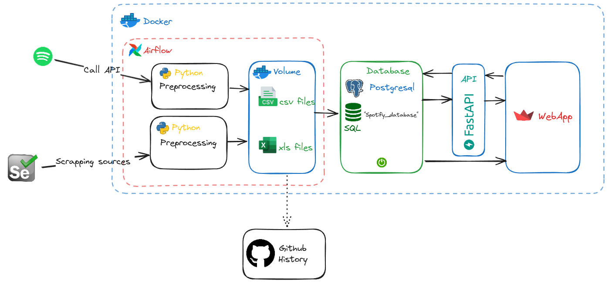
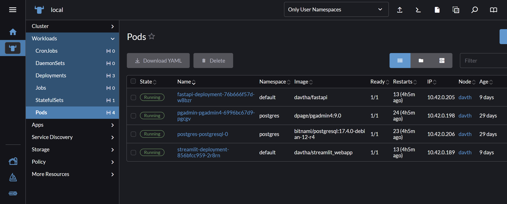
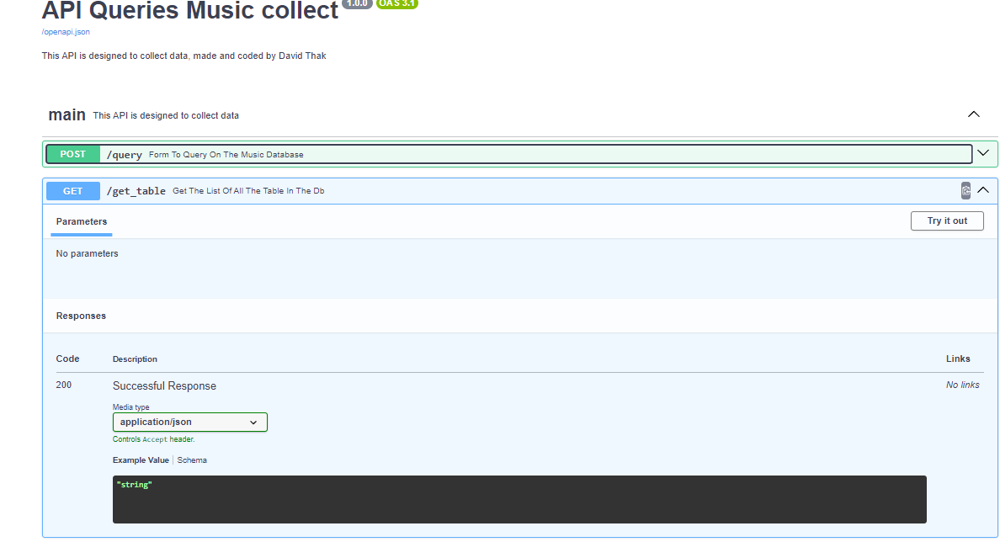
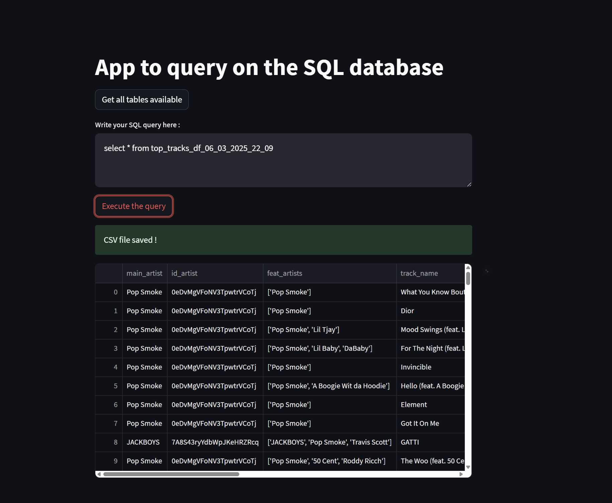

# I. Project Overview (v1)


### *What is the Spotify-ETL*

Spotify-ETL is a personal project aimed at creating an ETL pipeline for music data queried from Spotify and displaying the results on a dedicated web application.
This project 

### *What's the purpose*

The data is collected from a Spotify. Spotify provide a free API where you can get artists and music related data (from the [Spotify API](https://developer.spotify.com/documentation/web-api)) 

The collected data will include information about artists selected arbitrarily, along with their statistics (popularity, top tracks, number of listeners, etc.), as well as statistics on their top 10 tracks. The goal is to perform multiple extractions over time and track the performance of these artists (in the form of graphs) as their metrics evolve.

The project aims to showcase skills in both `DevOps` and `Data Engineering`, focusing on automation, data processing, and the integration of various technologies.

### *Tools & Technologies*

- **Data Collect** - [Requests (for API)](https://pypi.org/project/requests/), 
- **Containerization** - [Kubernetes](https://docs.docker.com/language/python/containerize/), [Rancher](https://www.rancher.com/)
- **Orchestration** - [Airflow](https://airflow.apache.org/docs/apache-airflow-providers/index.html#)
- **Database** - [PostgreSql](https://www.postgresql.org/docs/), [pgAdmin](https://www.pgadmin.org/)
- **API** - [FastApi](https://fastapi.tiangolo.com/)
- **WebApp** - [Streamlit](https://docs.streamlit.io/library/api-reference/write-magic)
- **Language** - [Python](https://docs.python.org/3/), [SQL](https://sql.sh/)

> [!NOTE]  
> Tools are chosen because I want to use it. Not optimized

# II. Architecture



List of the microservices deployed by Kubernetes cluster:
- Airflow
- pgAdmin
- postgresql
- fastapi
- streamlit

# III. Summary

0. Kubernetes application deployment
1. Data Extraction & Preprocessing
2. Orchestation on Airflow
3. Ingest and Export
4. FastAPI
5. WebApp on streamlit

# VI. Usage
### 0. Kubernetes application deployment
To deploy the platform, I use a Kubernetes cluster that will deploy the entire infrastructure in the form of deployments/pods.

To manage via a UI, I use Rancher, which allows me to quickly download Helm charts for [`PostgreSQL`](https://artifacthub.io/packages/helm/bitnami/postgresql), [`PgAdmin`](https://artifacthub.io/packages/helm/runix/pgadmin4), and [`Airflow`](https://artifacthub.io/packages/helm/apache-airflow/airflow). It facilitates the exposure of services and configuration.

However, some services are not directly available in the Helm charts, so I had to create the `Docker` images (via `DockerHub`) and then deploy them in pods (with a NodePort service to expose them).

> [!TIP]  
> change DNS to set the domain name 
### 1. Data Extraction & Preprocessing
The data extraction of the data is mainly made (exclusively for the moment) by the [Spotify API](https://developer.spotify.com/documentation/web-api). On which data is collected at a `JSON` format the is meant to be processed.

Mainly data on the artist himself and on his most successful hits are collected. 

To process these datas we will use `pandas` which is a python's framework that allow to manage data and process it. We aim to order these data in 2 differents dataframe dedicated for specific informations about the artist, and about his bests hits : 

```
- {YYYY_MM_YY:HH_MM_SS}_artists_data.csv
- {YYYY_MM_YY:HH_MM_SS}_top_tracks.csv
```
> [!NOTE]  
>These files are stored on the local machine that execute the scripts

*Sample of top tracks of an artist ("Pop Smoke") in `{YYYY_MM_YY:HH_MM_SS}_top_tracks.csv`:*

| track_name                                    | album_name                           | album_releasedate | album_totaltracks | track_duration | track_popularity | track_number |
|-----------------------------------------------|--------------------------------------|-------------------|-------------------|----------------|------------------|--------------|
| Dior                                          | Meet The Woo                         | 26/07/2019        | 9                 | 216386         | 83               | 6            |
| What You Know Bout Love                       | Shoot For The Stars Aim For The Moon | 03/07/2020        | 19                | 160000         | 82               | 15           |
| For The Night (feat. Lil Baby &amp;   DaBaby) | Shoot For The Stars Aim For The Moon | 03/07/2020        | 19                | 190476         | 80               | 3            |

*Sample of datas on the artists selected in `{YYYY_MM_YY:HH_MM_SS}_artists_data.csv`*:

| id                     | name         | genres                                                              | popularity | followers | image                                                            |   |
|------------------------|--------------|---------------------------------------------------------------------|------------|-----------|------------------------------------------------------------------|---|
| 0eDvMgVFoNV3TpwtrVCoTj | Pop Smoke    | ['brooklyn drill', 'rap']                                           | 78         | 13265520  | https://i.scdn.co/image/ab6761610000e5eb597f9edd2cd1a892d4412b09 |   |
| 0Y5tJX1MQlPlqiwlOH1tJY | Travis Scott | ['hip hop', 'rap', 'slap house']                                    | 90         | 25230238  | https://i.scdn.co/image/ab6761610000e5eb19c2790744c792d05570bb71 |   |
| 3TVXtAsR1Inumwj472S9r4 | Drake        | ['canadian hip hop', 'canadian pop', 'hip hop', 'pop rap',   'rap'] | 95         | 82340839  | https://i.scdn.co/image/ab6761610000e5eb4293385d324db8558179afd9 |   |

### 2. Orchestation on Airflow
It is interesting to use Airflow to run the two scripts in parallel and properly visualize the workflows. However, since the cluster is not always running and the use cases are simple (only two files generated from the Spotify API), I limit its usage. But it is very interesting to work with.
### 3. Ingest and Export

The script will store these file /tmp 
> [!NOTE]  
> Planned to use Kafka to ingest data

The export is made through the python script, it connects to the postgresDB on create the right table in the right database

### 4.  API via FastAPI

FAST API is a service that will be used to serve as an agent for retrieving data from the PostgreSQL database. A `GET` endpoint will be used to collect all the existing tables in the database, and a `POST` endpoint will be used to perform a specific `SQL` query, allowing to extract a table viewable on the WebApp.

The api is reachable on the cluster node address at the port configured in the pods service. The documentation is based from OpenAPI standard, it is accessible at `http://{node_address}:{port}/docs`



*The 2 endpoints are used for the minimalist application*

> [!TIP]  
> Improvements: use securized API with token.
### 5. WebApp on streamlit


The web application currently allows users to query the database via an SQL query and download the CSV file directly from the app. However, there is no functionality for analysis, graph generation, or the ability to adjust the list of artists at this stage.
> [!TIP]  
> Improvements: make data-analysis.
# VII. Enhancement and Update 
Next Steps for Version Upgrade (by priority):

### Development:

- Add Additional Scraping Sources: Expand data collection by incorporating more external scraping sources.
### Ingestion:

- Ingestion via Kafka: Optimize the data ingestion pipeline using Kafka for better scalability and real-time data streaming.
### Processing:

- Use DBT for Data Transformation: Implement DBT (Data Build Tool) for streamlined and automated data processing, ensuring cleaner and more reliable datasets.
### Web Application:

Better Analysis Features: Enhance the web application to allow more sophisticated analysis of the collected data, including better visualization and reporting.


### Security : 
- Password Credential Management: Enhance the security of the system by improving how passwords and credentials are handled.
- Securisation of the API
- Manage the accounts

### Cloud Integration:

- Migrate to AWS: Deploy the project on AWS to take advantage of cloud services such as scalability, security, and integration with other AWS tools.
- or expose by a reverse proxy
# VIII. Contact
e-m@il : david.thak4@gmail.com