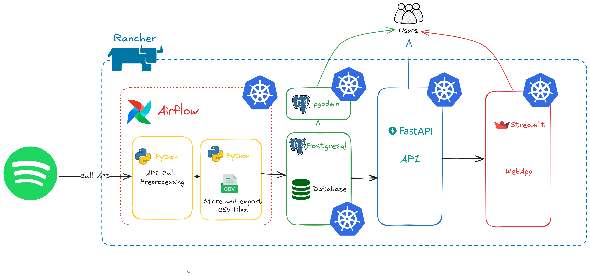

# I. Project Overview

[Go to Real Cool Heading section](#real-cool-heading)

### *Music data extraction Pipeline*

This project is a personal initiative aimed at creating an ETL pipeline for music data and displaying the analyzed data on a dedicated web app.

### *The process*

The data is initially collected from a data source. For simplicity, I will use the [Spotify API](https://developer.spotify.com/documentation/web-api) at this stage. The collected data will include information about artists selected arbitrarily, along with their statistics (popularity, top tracks, number of listeners, etc.), as well as statistics on their top 10 tracks.

The collection will be performed through an automated Docker container (daily collection) responsible for transforming the data into a DataFrame and then into temporary files (`.xls` and `.csv`). These files are intended to be deleted at the end of the dedicated container's execution.

These `CSV` and `XLS` files are archived on the GitHub repository (HERE) to maintain offline cloud-based versioning.

A continuously running PostgreSQL database will store the data persistently.

Querying will be done from the WebApp, where users can input an SQL query. The query will be transmitted via a FastAPI-designed POST REST API, allowing users to obtain a downloadable CSV file corresponding to the query.

Additionally, on this same web app, we will have analytical data on the selected artists.

### *Tools & Technologies*

- **Data Collect** - [Requests (for API)](https://pypi.org/project/requests/), ***Selenium (for webscrapping)***
- **Containerization** - [Docker](https://docs.docker.com/language/python/containerize/)
- **Orchestration** - [Airflow](https://airflow.apache.org/docs/apache-airflow-providers/index.html#)
- **Database** - [PostgreSql](https://www.postgresql.org/docs/), [Github](https://github.com/)
- **WebApp** - [Streamlit](https://docs.streamlit.io/library/api-reference/write-magic)
- **API** - [FastApi](https://fastapi.tiangolo.com/)
- **Language** - [Python](https://docs.python.org/3/), [SQL](https://sql.sh/)

> [!NOTE]  
> The majority of technologies used are chosen arbitrarily to provide an opportunity for hands-on practice with specific tools.

# II. Architecture



> [!NOTE]  
> Micro-service architecture offers numerous advantages:
>The different services are autonomous and can be developed by different teams, in various languages, as they can communicate with each other via their APIs.
>
> - Each service is specialized in solving a single task, which makes it easier to identify problems or evolve a service.
> - As each service is a small, independent unit of the rest of the system and specialized, it can be easily modified, thus allowing for faster and more agile development cycles.
> - If some services require more resources (storage, computation), or if their resource needs change over time, it's easy to scale up a service without disrupting the functioning of other services.
> - A service can be easily reused by other teams in other projects. The API indeed provides precise documentation on the use of the service, allowing other teams to include the service in their applications.
Finally, it's easy to identify the sources of failures in such a system and repair these failures quickly or even modify the service to prevent the failure from reoccurring.

# Results

### WebApp query

### WebApp data Analysis

# III. Summary

1. [Data Extraction (API Call & Scrapping)](#mon-ancre)
2. [Preprocessing]
3. [Storing in Volume]
4. [Historization on Github]
5. [Loading in Database (SQL)]
6. [Queries via FastAPI]
7. [WebApp on streamlit]
8. [Orchestation on Airflow]
9. [DBT SQL versioning]

# IV. Project Structure

The project structure is generated by this [website](https://tree.nathanfriend.io/)

# VI. Usage

### 1. Data Extraction (API Call & Scrapping)
The data extraction of the data is mainly made (exclusively for the moment) by the [Spotify API](https://developer.spotify.com/documentation/web-api). On which data is collected at a `JSON` format the is meant to be processed.

Mainly data on the artist himself and on his most successful hits are collected. 

### 2. Preprocessing
To process these datas we will use `pandas` which is a python's framework that allow to manage data and process it. We aim to order these data in 2 differents dataframe dedicated for specific informations about the artist, and about his bests hits : 

```
- artists_data.csv
- top_tracks.csv
```

> [!NOTE]  
>Each extraction will be followed by the date (YYYY_MM_YY:HH_MM_SS) of the extraction.

*Sample of top tracks of an artist ("Pop Smoke") in `top_tracks.csv`:*

| track_name                                    | album_name                           | album_releasedate | album_totaltracks | track_duration | track_popularity | track_number |
|-----------------------------------------------|--------------------------------------|-------------------|-------------------|----------------|------------------|--------------|
| Dior                                          | Meet The Woo                         | 26/07/2019        | 9                 | 216386         | 83               | 6            |
| What You Know Bout Love                       | Shoot For The Stars Aim For The Moon | 03/07/2020        | 19                | 160000         | 82               | 15           |
| For The Night (feat. Lil Baby &amp;   DaBaby) | Shoot For The Stars Aim For The Moon | 03/07/2020        | 19                | 190476         | 80               | 3            |

*Sample of datas on the artists selected in `artists_data.csv`*:

| id                     | name         | genres                                                              | popularity | followers | image                                                            |   |
|------------------------|--------------|---------------------------------------------------------------------|------------|-----------|------------------------------------------------------------------|---|
| 0eDvMgVFoNV3TpwtrVCoTj | Pop Smoke    | ['brooklyn drill', 'rap']                                           | 78         | 13265520  | https://i.scdn.co/image/ab6761610000e5eb597f9edd2cd1a892d4412b09 |   |
| 0Y5tJX1MQlPlqiwlOH1tJY | Travis Scott | ['hip hop', 'rap', 'slap house']                                    | 90         | 25230238  | https://i.scdn.co/image/ab6761610000e5eb19c2790744c792d05570bb71 |   |
| 3TVXtAsR1Inumwj472S9r4 | Drake        | ['canadian hip hop', 'canadian pop', 'hip hop', 'pop rap',   'rap'] | 95         | 82340839  | https://i.scdn.co/image/ab6761610000e5eb4293385d324db8558179afd9 |   |

Theses dataframe will be stored load in a PostgreSQL Database. 

### 3. Ingesting in Docker Volume
The script is executed in a `Docker` container that will ingest the output Data in a docker volume. The `Docker` volume will stored locally the data in the /tmp repo.
In this case we ensure to keep the data temporarily.

### 4. Historization on Github
*We can automate the historization in a repo on github with correct credential that will allows us to keep a tracking on csv file ...* 

### 5. Loading in Database (SQL)

### 6. Queries via FastAPI

> [!NOTE]  
>FastAPI is a modern, fast (high-performance) web framework for building APIs with Python 3.7+ based on standard Python type hints. It was created by Sebastián Ramírez and first released in December 2018. The key features of FastAPI include automatic data validation, serialization, documentation with OpenAPI, and high performance, comparable to NodeJS and Go.

FAST API is a service that will be used to serve as an agent for retrieving data from the PostgreSQL database. A `GET` endpoint will be used to collect all the existing tables in the database, and a `POST` endpoint will be used to perform a specific `SQL` query, allowing to extract a table viewable on the WebApp.

This service is hosted at the address `http://localhost:8000` the documentation is based from OpenAPI standard, it is accessible at `http://localhost:8000/docs`


*The 2 endpoints are used for the minimalist application*

> [!CAUTION]  
> The API will not be secured as it is intended for local use (💡improvements).

### 7. WebApp on streamlit

### 8. Orchestation on Airflow

### 9. DBT SQL versioning

# V. Setup

# VII. Enhancement & Known Issues

- ELK
- Kafka
- K8S

# VIII. Contact

# real-cool-heading
